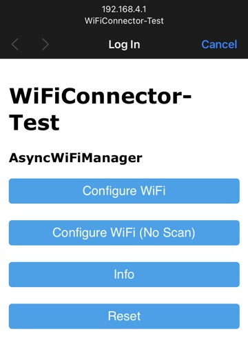

# stevesch-PageHandler

This library provides automatic reflection of variables between an ESP32 microcontroller web server and the web clients displaying the HTML pages of that server.  The library is designed to have minimal setup and be easy to customize to suit your needs.

The library example uses stevesch-WiFiConnector for simple wifi setup (with config portal), but other wifi intialization may be used as long as an AsyncEspWebServer object is provided to this library's setup routine.

The example sketch serves a dynamic web page that has examples for cards that communicate variables to and from the ESP32 server, as well as real-time graphing capability:


# Building and Running

To get up-and-running:
- PlatformIO is recommended
- Build this library (builds its own minimal example)
- Upload to any ESP32 board
- Choose "Upload and Monitor" to perform all steps at once (build, upload, then monitor) or choose individually if you're having issues and wish to examine the error output of a particular stage more easily.
- Choose "Upload Filesystem Image" to upload the required data files to the SPIFFS file system on the ESP32.  (This uploads the HTML, CSS, and javscript files required for serving the web pages the the clients).


- When your board is booted, a WiFi config portal named "pagehandler-test" should be available.
- Connecting to the "pagehandler-test" WiFi network with any device and set the config options for the WiFi network of your router (choose your network/SSID and set the password).



- Connect to your router's WiFi network and open the ESP32 page in any browser.  The IP of the device will be displayed in the serial output if you're monitoring serial output of the board.  If your router supports mDNS, you should be able to open

"http://pagehandler-test.local/"

(otherwise you'll need to open, e.g.

"http://192.168.x.x" or "http://10.x.x.x"

where x.x/x.x.x matches the address displayed in the serial output from your board).

# Customizing for your own web page

The "index.html" and "style.css" pages in the examples/minimal/data folder can be used as a starting point for your own page.  Customize the contents of these to suit your purposes.

The "pageHandler.js" file in the data folder should be copied as-is (without modification) to your data folder (along with your index.html and style.css, or whatever page files you require).  This javascript file provides the standard hookup and data reflection required by the server.  Your HTML file should include the script and call "initPageHandler" upon load, just as in the example index.html.

```
<!DOCTYPE HTML>
<html>
  . . .
<head>
  . . .
</head>
<body>
  . . .
  <script src="/pageHandler.js" type="text/javascript">
  </script>
  <script>
    var reflections = [ %REFL_LIST% ];
    function initPageHandler(reflections)
  </script>
  . . .
</body></html>
```

Thie script will replace statically specified variables with the server values, send variable changes from controls to the server, and hook up server-side event listeners to update displays in real time when variables are received from the server.

Remember to "Upload Filesystem Image" whenever you change the HTML, CSS, or JavaScript files in your data folder.

# Customization details

Client side variables (i.e. those displayed in your HTML) are specified, for example, like this:
```
<span data-varinner="INTVALUE1">%INTVALUE1%</span>
```
and correspond to a server-side variable (in code on your ESP32) like this:

```
VarReflector<int> vrIntValue1("INTVALUE1", 17);

void loop() {
  int x = vrIntvalue1;
  // . . . do something with x
  vrIntValue1 = x;

  stevesch::PageHandler::processAndSendUpdatedServerValues();
}
```

In this example case, the web page would display the initial value (17) in place of %INTVALUE1%.

The inner text of the span will be replaced whenever the server-side variable, vrIntValue1, changes.

The following is an example of a control (in this case, a slider) that sends values back to the server:
```
<input type="range" min="0" max="255" class="watcher" value="%INTVALUE1%" data-varname="INTVALUE1" onchange="sendValueChange(event)"/>
```

The "watcher" class specification additionally says that this control will respond to changes sent _from_ the server.
